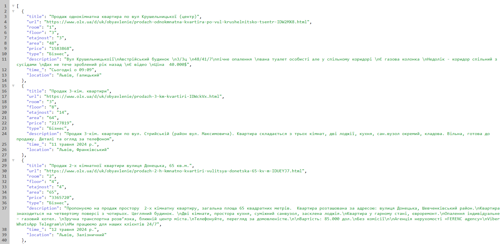

# Оценка и анализ недвижимости
### Стек технологий:
- NGINX
- NODE (EXPRESS)
- FLASK(scikit-learn, pandas, matplotlib)
- LARAVEL
- MYSQL

### Схема БД:

### Порядок работы:
1. Выбираем на сайте OLX недвижимость(указываем цены в грн., автоматически система сделает расчет в $)

2. Вставляем ее и нажимаем обновить. Она добавится в систему и ее не нужно будет большо загружать.

После этого нажимаем обновить
3. На сервере node будет выполнятся загрузка данные с последующим сохранением в формате json
```
import fetch from 'node-fetch';
import * as cheerio from 'cheerio';
import fs from 'fs';
import path from 'path';

class Realtor {
constructor() {
this.baseUrl = 'https://www.olx.ua';
this.entries = [];
this.urls = [];
}

    async fetchHTML(url) {
        const response = await fetch(url);
        if (!response.ok) {
            throw new Error(`Failed to fetch ${url}: ${response.statusText}`);
        }
        return response.text();
    }

    async getUrls(url) {
        const html = await this.fetchHTML(url);
        const $ = cheerio.load(html);
        $('.css-qfzx1y').each((_, element) => {
            let $element = $(element);
            let url = this.baseUrl + $element.find('a.css-z3gu2d').attr('href');
            // let area = $element.find('.css-643j0o').text();
            let price = $element.find('p[class="css-tyui9s er34gjf0"]').text().split(' ');
            price = price.slice(0, price.length-1);
            price = price.join('');
            let location_time =  $element.find('p[class="css-1a4brun er34gjf0"]').text().split('-');
            let location = location_time[0].trim();
            // let time_ = location_time[1];
            this.urls.push({ "url": url, "location":location, "price":price });
        });
    }
    async getUrl(){
        let data = this.urls;
        for (let i = 0; i < data.length; i++) {
            let obj = data[i];
            await this.getData(obj.url, obj.location, obj.price);
        }
    }
    async getData(url, location, price) {
        const html = await this.fetchHTML(url);
        const $ = cheerio.load(html);
        let title = $('.css-1dp6pbg').find('h4.css-1juynto').text();
        let time_ = $('.css-1dp6pbg').find('span.css-19yf5ek').text();
        // let price = $('.css-1dp6pbg').find('h3.css-12vqlj3').text();
        let description = $('.css-1wws9er').find('.css-1t507yq').text();
        let text = $('.css-sfcl1s').find('p.css-b5m1rv').text();
        let floor = text.match(/Поверх: (\d+)/g)[0].split(': ')[1];
        let room = text.match(/Кількість кімнат: (\d+)/g)[0].split(': ')[1];
        let area = text.match(/Загальна площа: (\d+)/g)[0].split(': ')[1];
        let type = text.includes("Бізнес") ? "Бізнес" : "Приватна";
        let etajnost = text.match(/Поверховість: (\d+)/g)[0].split(': ')[1];
        this.entries.push({ title, url, room, floor, etajnost, area, price, type, description, time_, location });
    }

    async saveData(i) {
        const filePath = path.join('files', 'realtor', `${i}_olx_realtor.json`);
        fs.writeFileSync(filePath, JSON.stringify(this.entries, null, 2), 'utf8');
    }

}

export { Realtor };
```
### Пример сохранения объекта
```
{
"title": "Квартира центр авторський ремонт",
"url": "https://www.olx.ua/d/uk/obyavlenie/kvartira-tsentr-avtorskiy-remont-IDUOFVL.html",
"room": "1",
"floor": "3",
"etajnost": "3",
"area": "25",
"price": "3761687",
"type": "Приватна",
"description": "Продам дуже стильну та оригінальну квартиру з дизайнерськими меблями з натурального дерева в поєднанні з металом .Багато озеленення що не потребує особливого догляду та додає затишку .Все продумано до деталей для успішного бізнесу в по добовій чи тривалій оренді. Квартира оснащена сучасною технікою : пральна машинка ,сушарка,посудомийка ,холодильник ,мікрохвильовка ,витяжка, духовка все під забудову.Максимально раціонально використаний простір. Високі стелі ,3 фасадних вікна з класним видом на місто поруч форум .Не шумна вулиця Люльки .\nКондиціонер ,автономне опалення підігрів підлоги котел Vaillant з дозвільними документами .Тропічний душ ,гігієнічний душ , плазмові смарт ТВ телевізори,оптика в квартирі та wifi. \nСтіна скеля ,умивальник з мармуру флораріуми з живими рослинами. Та багато іншого .\nВсе зроблено з якісних матеріалів.\nВ підʼїзді косметичний ремонт .Є кладовка та підвал 20кв .",
"time_": "12 травня 2024 р.",
"location": "Львів, Галицький"
}
```
### Также есть доступ к результатам по api

4. Нажимаем Загрузить данные и они добавятся в бд

Можно редактировать, просматривать, переходить к самому объявлению на сайте, добавлять комментарии к нему,
добавлять в избранное и удалить из бд. Также предусмотрена сортировка и поиск данных.
5. После нажатия "Выполнить синхранизацию" будет произведен аналитический расчет цен
Для аналитического расчета используется модель "Линейная регрессия" и "Случайный лес"
Система сделает расчет актуальности цены, недооцененности или переоцененность квартиры, ранжирует факторы и создаст матрицу.


6. Можно добавлять заявки на покупку и продажу
7. После заявки на покупку появится возмодность подобрать недвижимость по схожим критерием используя модель "AffinityPropagation"

8. При добавлении заявки на продажу можно отправить запрос на прогнозирование цены по аналогичным квартирам используя "Случайный лес"
